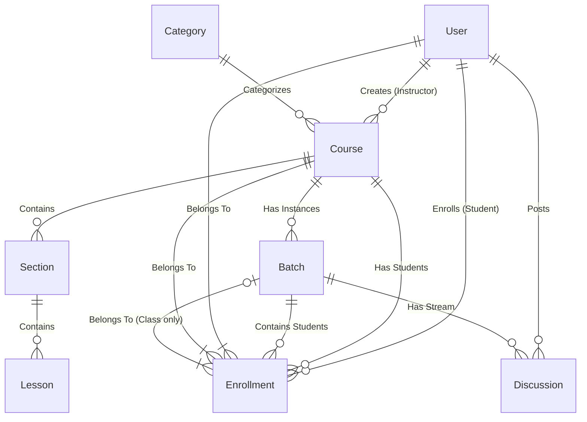

# Dokumentasi Sistem Hybrid LMS

## 1. Pendahuluan

Sistem Hybrid LMS ini adalah platform pembelajaran yang menggabungkan dua model pembelajaran utama:

1.  **Struktural (Udemy-style)**: Pembelajaran mandiri berbasis konten kursus video/teks yang dapat dibeli atau diakses secara bebas.
2.  **Klasikal (Google Classroom-style)**: Pembelajaran berbasis kelas/cohort yang interaktif antara instruktur dan sekelompok siswa tertentu.

## 2. Alur Proses Bisnis (Business Process)

### A. Model Pembelajaran Struktural (Self-Paced)

1.  **Instruktur** membuat Materi Kursus (Kurikulum, Video, Kuis).
2.  **Admin** meninjau dan mempublikasikan kursus.
3.  **Siswa** menjelajahi katalog kursus publik.
4.  **Siswa** membeli kursus (transaksi via Cart & Checkout).
5.  **Sistem** memberikan akses materis setelah pembayaran sukses.
6.  **Siswa** belajar mandiri sesuai kecepatannya sendiri.

### B. Model Pembelajaran Klasikal (Hybrid Class)

1.  **Instruktur** membuat "Kelas" baru.
2.  **Sistem** memgenerate Kode Kelas unik.
3.  **Instruktur** membagikan Kode Kelas kepada siswa.
4.  **Siswa** bergabung ke kelas menggunakan Kode Kelas ("Join Class").
5.  **Instruktur** memposting materi, pengumuman, atau pertanyaan di "Stream".
6.  **Siswa** dan **Instruktur** berinteraksi dalam diskusi kelas.
7.  **Instruktur** memberikan tugas dan materi spesifik untuk kelas tersebut.

## 3. Modul & Fitur Detail

### 3.1. Modul Autentikasi (`Auth`)

- **Register**: Pendaftaran pengguna baru (Siswa/Instruktur).
- **Login**: Akses aman ke dalam sistem menggunakan Token (Sanctum).
- **Lupa Password**: Mekanisme reset password via email.
- **Verifikasi Email**: Memastikan validitas email pengguna.

### 3.2. Modul Admin (`Admin`)

Admin memiliki kendali penuh atas data induk sistem.

- **Dashboard**: Statistik total user, kursus, dan transaksi.
- **Manajemen Kategori**: Mengelola kategori kursus (misal: "Pemrograman", "Desain").
- **Verifikasi Instruktur**: Menyetujui pendaftaran instruktur.

### 3.3. Modul Instruktur (`Instructor`)

Fitur untuk pembuat konten dan pengajar.

- **Manajemen Kursus (`Courses`)**:
    - Membuat kursus baru (Judul, Deskripsi, Harga).
    - Mengupload Thumbnail dan Video Preview.
    - Menyusun Kurikulum (Section & Lesson).
- **Manajemen Kelas (`Classes`)** [Fitur Baru]:
    - Membuat Kelas Hybrid.
    - Melihat daftar siswa (People).
    - Mengelola Stream/Feed Kelas.
    - Menambahkan Materi Kelas (Classwork).
- **Tugas & Penilaian**: Membuat soal dan memberi nilai pada submission siswa.

### 3.4. Modul Siswa (`Student`)

- **Dashboard Belajar**: Melihat kursus yang diikuti dan progress belajar.
- **Katalog & Pembelian**:
    - Mencari kursus.
    - Menambah ke Keranjang (`Cart`).
    - Checkout dan Pembayaran.
- **Ruang Kelas (`My Classes`)**:
    - Bergabung ke kelas dengan Kode.
    - Mengakses materi kelas & berdiskusi.
- **Sertifikat**: Mengunduh sertifikat setelah menyelesaikan kursus (jika ada).

### 3.5. Fitur Kelas (Hybrid Features)

Fitur spesifik yang mengadopsi gaya Google Classroom.

- **Stream**: Halaman utama kelas berisi lini masa pengumuman dan diskusi.
- **Classwork**: Tab berisi materi dan topik pelajaran yang terstruktur.
- **People**: Daftar anggota kelas (Instruktur & Siswa).
- **Class Code**: Kode unik 6-karakter untuk akses mudah.

## 4. Arsitektur Teknis (API)

Sistem dibangun sebagai **REST API** menggunakan Laravel.

- **Backend**: Laravel 11.x
- **Database**: MySQL
- **Security**: Laravel Sanctum (Token-based Auth).
- **Endpoints**:
    - `/api/v1/auth/*`: Autentikasi
    - `/api/v1/admin/*`: Area Admin
    - `/api/v1/instructor/*`: Area Instruktur standar
    - `/api/v1/student/*`: Area Siswa standar
    - `/api/v1/classes/*`: Fitur Kelas Hybrid
    - `/api/v1/public/*`: Data publik

## 5. Struktur Relasi Data (Entity Relationship)

Berikut adalah gambaran umum bagaimana entitas data saling berelasi dalam sistem ini:

### Penjelasan Relasi Utama:

1.  **User & Role**:
    - Satu **User** bisa menjadi **Instructor** (memiliki banyak `Course`) sekaligus **Student** (memiliki banyak `Enrollment`).
2.  **Course Structure**:
    - **Course** adalah entitas induk materi.
    - Terdiri dari banyak **Section** (Bab), dan setiap Section memiliki banyak **Lesson** (Materi/Video).
3.  **Hybrid Class Logic**:
    - **Batch** adalah representasi "Kelas" atau "Angkatan".
    - Setiap **Batch** terikat pada satu **Course** (1:N). Satu Course bisa memiliki banyak Batch (misal: Kelas A, Kelas B).
    - **Enrollment** mencatat pendaftaran siswa.
        - Jika `batch_id` terisi -> Siswa masuk via Kelas (Hybrid).
        - Jika `batch_id` kosong -> Siswa membeli Course mandiri (Self-paced).
4.  **Interaction**:
    - **Discussion** (Stream) terikat pada **Batch**, memungkinkan diskusi privat antar anggota kelas tersebut saja.

---

_Dokumen ini dibuat otomatis oleh Sistem Hybrid LMS._

## License

The Laravel framework is open-sourced software licensed under the [MIT license](https://opensource.org/licenses/MIT).
